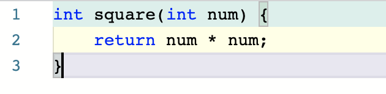
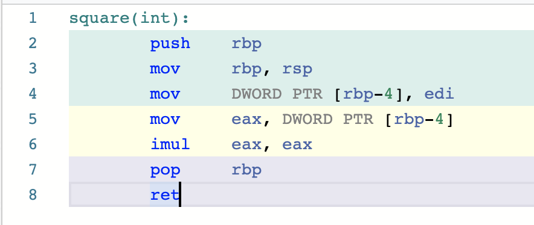

⚠ _This is still an early draft_

---

## 🎡 Summary

Foreign functions are amazing - it's magical that you can call functions defined
in one language from another.

## ⏳ Timeline

_2 Minutes: Explain FFI, introduction_

Operating systems like Linux manage access to shared resources like files and
network connections with syscalls and typically the API is exposed via the C
standard library. Almost all programming language standard libraries eventually
deep down end up calling into these functions via some kind of Foreign function
interface. Any kind of interesting programs more sophisticated than a desktop
calculator that needs to interact with the world need FFI.

**TODO**: Could expand a bit more here and set context right??_

_1 Minutes: Explain why I'm interested in this?_

I've been working on a toy scheme compiler for a while and wanted to figure out
how hard it would be to implement a very simple toy FFI model from scratch and
it turned out to be a lot simpler than I imagined!

To pick a specific example, we can look at how you can call into C/Rust
functions from Scheme even though they differ in so many ways like memory
management, alignment, type systems etc.

_4 Minutes: Explain x86 assembly functions, keep it short!_

There are no functions in x86 assembly. All you have is registers, shared memory
(in the form of stack & heap) and labels you can jump to. Think of registers as
global variables, shared memory as one big array and labels as line numbers in
code you can jump to.







*Picture*: Side by side comparison of a very simple function in C and asm.

**TODO**: Expand this example with a call to the function as well.

So many things you can take for granted and is implicit in almost all high level
languages like argument passing, return values etc are explicitly managed in
assembly. This is in part really tedious and error prone, but the flexibility
also allows compilers to implement very different programming paradigms on the
same hardware and often make them seamlessly cooperate.

There are numerous ways of compiling functions, but some of them were
standardized into well known "[Calling Conventions][cc]". For example, the
[__cdecl][cdecl] or "C Declaration" convention pass all arguments on stack while
[System V AMD64 ABI][sysv] used for system calls on Linux pass first 6 arguments
in registers and the rest on stack. Possibilities are endless, but having some
standardized conventions help with interoperability.

_Pause, Emphasize_

In short, an FFI model either compiles down 2 different languages into the same
kind of assembly functions or add a layer of indirection b/w the function calls
to translate values back and forth so that different language runtimes can talk
to each other.

| Same runtime representation               | Translation layer      |
| -                                         | -                      |
|                                           |                        |
| High performance                          | Wider interoperability |
| *TODO*: Expand on this with some examples |                        |


_2 Minutes, Back to scheme example_

```scheme
(writeln "Hello !!con 👋"
    (open-output-file "/tmp/inc/io.txt"))
```

```rust
#[no_mangle]
pub extern "C" fn writeln(data: i64, port: i64) -> i64 {
    let path = str_str(vec_nth(port, 1));
    let s = format!("{}\n", str_str(data));

    fs::write(&path, s)
        .unwrap_or_else(|_|
            panic!("Failed to write to {}", &path));

    NIL
}
```

Scheme and Rust differ in so many ways! This implementation of Scheme is an
untyped, garbage collected language that represents values very differently from
Rust in memory.

In this particular example, we compile both languages into the same runtime
representation and while making the Rust layer aware of the scheme memory layout
and communicate with pointers. For example, file desciptors are numbers in C, a
vector in scheme and a struct in Rust.

*TODO*: `extern "C"`

_👆 This is confusing, needs rewording_


```asm
    .globl _init
_init:
    push rbp
    mov rbp, rsp
    mov r12, rdi        # Store heap index to R12
    lea rax, [rip + 5 + inc_str_0]
    mov qword ptr [rbp - 24], rax
    call "open-output-file"
    mov qword ptr [rbp - 8], rax
    lea rax, [rip + 5 + inc_str_1]
    mov rdi, rax
    mov rax, [rbp - 8]
    mov rsi, rax
    sub rsp, 16
    call "_writeln"
    add rsp, 16
    pop rbp
    ret
```


_👆 Pick what's needed from this example and ignore the rest_

*TODO* Leave assembly for `_writeln!` side by side, Show how the arguments are
copied into the right registers and stack is manually aligned in few lines
above. Maybe use some arrows to "link" things together on both sides.

_⌛ Last minute, wrap up!_

Talk about how agreeing to a common convention made this possible!

<Demo! Print hello world or something!>

👏

---

# Notes:

1. Read
   http://composition.al/blog/2018/03/31/four-kinds-of-talk-proposals-that-get-rejected-from-bangbangcon/

2. Link to https://blog.filippo.io/rustgo for shim exmaple

---

[cc]: https://docs.microsoft.com/en-us/cpp/cpp/argument-passing-and-naming-conventions?view=vs-2019
[cdecl]: https://en.wikipedia.org/wiki/X86_calling_conventions#cdecl
[sysv]: https://en.wikipedia.org/wiki/X86_calling_conventions#System_V_AMD64_ABI
