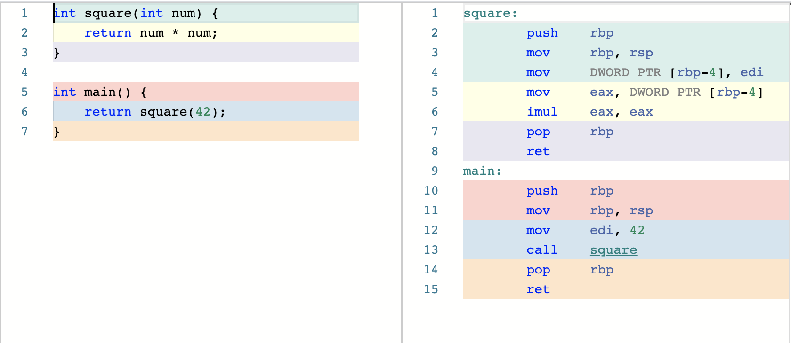

📣 _This is still an early draft, need a lot more polishing_ <br/>
✋ _Notes and todos_ <br/>
🕙 _Timeline hints_ <br/>

---

## 🎡 Summary

Foreign functions are amazing!!

I'd like to explore how high level programming languages call into functions
defined in low level languages like C or Rust. This talk will cover a few
examples, show how you can implement this yourself and hopefully will get you
excited about some low level details about how operating systems and hardware
works!

## ⏳ Timeline

🕙 _2 Minutes: Explain FFI, introduction_

Why would a high level language even want to call into C functions? Why can't
you reimplement everything you might need in stdlib?

Operating systems like Linux manage access to resources like files and network
connections with syscalls and typically the API is exposed via the C standard
library. Almost all programming language standard libraries eventually use these
functions via some kind of Foreign Function Interface to open a file, make a
network request or read the current time.

For interpreted languages with a runtime written in C, this is a significantly
simpler problem to solve. For example, Python's `write()` builtin [is only a
very thin wrapper][py3] over libc's `write()`, which for musl is just a [1 liner
wrapper][musl] over the `write()` syscall.

The problem gets a whole lot more interesting for compiled languages with a
memory model significantly different from C.

🕙 _1 Minutes: Explain why I'm interested in this and some context_

I've been working on a [toy scheme compiler][inc] for a while and wanted to
figure out how hard it would be to implement a very simple FFI from scratch and
it turned out to be a lot simpler than I imagined!!

To pick a specific example, we can look at implementing a `(writeln ...)`
primitive using Rust.

🔥 *TODO*: Replace this example without `open-output-file`, write a primitive
that takes data and path.

```scheme
(writeln "Hello !!con 👋"
    (open-output-file "/tmp/io.txt"))
```

```rust
#[no_mangle]
pub extern "C" fn writeln(data: i64, port: i64) -> i64 {
    let path = str_str(vec_nth(port, 1));
    let s = format!("{}\n", str_str(data));

    fs::write(&path, s)
        .unwrap_or_else(|_|
            panic!("Failed to write to {}", &path));

    NIL
}
```

The memory model of (this implementation of) Scheme and Rust couldn't be any
more different. Scheme is an untyped, garbage collected language that uses a
form of tagged objects to represent all values along with their types at
runtime, while Rust is a non garbage collected, statically typed language with
usually well optimized memory layout for most values. For example, file
descriptors are numbers in C, a vector in scheme and a struct in Rust.

Bridging the gap opens up so many possibilities!!

🕙 _4 Minutes: Explain x86 assembly functions, keep it short!_

To understand how this works, we need to learn about x86 assembly functions and
calling conventions.

There are no functions in x86 assembly. All you have is registers, shared memory
(in the form of stack & heap) and labels you can jump to. Think of registers as
global variables, shared memory as one big array and labels as line numbers in
code you can jump to.



So many things you can take for granted and is implicit in almost all high level
languages like argument passing and returning values are explicitly managed in
assembly. This is in part really tedious and error prone, but the flexibility
also allows compilers to implement very different programming paradigms on the
same hardware and often make them seamlessly cooperate.

In the above example, `main` copied the argument `42` to `EDI` register and then
jumped to the source for square. Square reads argument from `EDI` and writes the
result to `EAX` before jumping back to `main()`. As long as the caller and
callee agree on the same registers, you can do this in countless different ways,
but some of them were standardized into well known [Calling Conventions][cc].
For example, the [__cdecl][cdecl] (C Declaration) convention pass all arguments
on stack while [System V AMD64 ABI][sysv] used here passes first 6 arguments in
registers RDI, RSI, RDX, RCX, R8, R9 and the rest on stack. Possibilities are
endless, but having some standardized conventions help with interoperability.

🕙 _Pause, Emphasize_

✋ _TODO: Really double check this section!!_

The most common and simplest approach to FFI is using the C ABI as lingua
franca, so that anything can call anything. Rust supports C ABI with `extern
"C"` pragma and we can make it use the same conventions.

If the representation of values differ, a translation layer (usually called a
trampoline) can convert the values back and forth. For example, C usually
expects null terminated strings, but a lot of newer runtimes prefer to store a
pair of length and bytes.

🕙 _3 Minutes, Back to scheme example_

Coming back to the original example we started with, `writeln!()` works like a
trampoline between Scheme and the system calls by translating values back and
forth. Scheme objects are passed directly to `writeln` and it extracts the
necessary raw strings before delegating the task to `fs::write()`. To denote
success, the default value of `NIL` is returned back to scheme.


```asm
    .globl "_init"
"_init":
    push rbp                        # Standard preamble
    mov rbp, rsp

    lea rax, [rip + 5 + inc_hello]  # Point RAX to string /tmp/hello.txt
    mov qword ptr [rbp - 24], rax   # Copy path argument to stack at [RBP - 24]

    call "open-output-file"

    mov qword ptr [rbp - 8], rax    # Store file descriptor into [RBP - 8]
    lea rdi, [rip + 5 + inc_path]   # Point RDI  to string "Hello !!con 👋",  this is arg 1
    mov rsi, [rbp - 8]              # Copy file descriptor to RSI, this is arg 2

    call "_writeln"                 # Call _write with SYS V convention

    pop rbp
    ret

    .p2align 3
"inc_hello":
    .quad  16
    .asciz "Hello !!con 👋"

    .p2align 3
"inc_path":
    .quad  14
    .asciz "/tmp/hello.txt"
```

_⌛ Last minute, wrap up!_

If you take a step back and observe, its pretty amazing that you could do this
in less than 10 lines of assembly. I'm impressed!

👏

[cc]: https://docs.microsoft.com/en-us/cpp/cpp/argument-passing-and-naming-conventions?view=vs-2019
[cdecl]: https://en.wikipedia.org/wiki/X86_calling_conventions#cdecl
[go]: https://github.com/golang/go/blob/master/src/syscall/zsyscall_linux_amd64.go#L907-L920
[musl]: https://git.musl-libc.org/cgit/musl/tree/src/unistd/write.c
[py3]: https://github.com/python/cpython/blob/03a8a56faca0c1851051269e3517d70cbce830b7/Python/fileutils.c#L1555-L1583
[rust abi]: https://gankra.github.io/blah/rust-layouts-and-abis
[sysv]: https://en.wikipedia.org/wiki/X86_calling_conventions#System_V_AMD64_ABI
[inc]: https://github.com/jaseemabid/inc/
