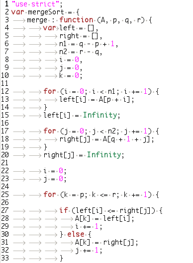

# Programming lessons I learned

Things I learned outside the classroom that might help somebody :)

### 1. Learn to version control your code.

Learn [Git](http://git-scm.com)!

Its a bit pain to learn, agreed! so is every other VCS out there. It will surely
change the way you code forever, if you put some effort into learning it
properly.

The basic idea of git is that you can get back to any version of your code at
any time. It makes collaboration a breeze. It will tell you who added a line of
code at what point of time. You commit when something works, add a decent commit
message
[[[1]]](http://tbaggery.com/2008/04/19/a-note-about-git-commit-messages.html)
[[[2]]](https://github.com/erlang/otp/wiki/Writing-good-commit-messages) to help
yourself later, and continue working. Before the next commit, look at the diff
to see what you are going to commit, think again if that is exactly what you
want to do and go on. Are you stuck with some nasty bugs? Revert to last known
working version, and continue your work in a fresh manner or stash your current
changes for later review.

Read [Git best practices](http://sethrobertson.github.com/GitBestPractices/).
Its one of the most dense articles I have come across yet. It will surely reward
you.

Here are a [few tutorials](https://gist.github.com/1321592) I collected which
might help.

### 2. Have some sane white space in your code.

White spaces are important.

The ideal way to fix this will be to use [emacs smart
tabs](http://www.emacswiki.org/SmartTabs)

People who find that difficult should at least use the whitespace highlight
plugin with gedit. Here is a screen shot with white space plugin enabled.


Intent all your lines with either fixed amount of spaces alone, say 4 or with
tabs alone. Tabs are better IMHO because they lead to smaller files and anybody
can adjust tab widths to read it as per their convenience without actually
editing the file. This makes patches real patches and not just white space
modifications. It makes the file consistent across platforms and editors.

Update 1 : Seems like more people prefer spaces over tabs. I am yet to find a
solid argument which makes one better than the other.

Update 2 : 'leads to smaller files...' seems to be a bit pointless to me now
(Read the comments). I either compile or minify my code before deploying, which
makes large files not a problem at all. Thanks to @darrencauthon for the
comment.

### 3. Pick a real programmers editor.

I'm going a bit inclined here. Pick emacs, not vim.

There are infinite number of comparisons online. I'll state my reason for
picking emacs over vim. Vim is a modal editor and it suggests you stay in the
normal mode by default. It makes moving around very easy and when you want to
insert text, you type `i` to get to insert mode and then type in the content.

I realized that this is not how "I" work with my code. Emacs is not a modal
editor. You can insert text at all times. It uses control meta keys more
efficiently and makes moving around and inserting text at the same time a
breeze. I think I can beat a kickass vim guy with my basic emacs skills.

Watch this [video](http://emacsrocks.com/e02.html)

Here are some good emacs videos to get started.

1. [EmacsRocks](http://emacsrocks.com/)
2. [emacsmovies.org](http://emacsmovies.org/)
3. [PeepCode](https://peepcode.com/products/meet-emacs/), if you can pay for it

If you prefer downloading videos for offline viewing, use wget for downloading
all EmacsRocks episodes:)

```
    wget http://dl.dropbox.com/u/3615058/emacsrocks/emacs-rocks-{01..11}.mov?dl=1
```

### 4. Contribute to a FOSS

This is actually easier than it sounds. Pick some small application, interact
with the community and fix issues which you can. I was able to fix some issues
with gedit during my last vacation and I am working on more of it now. Also, I
am porting the JavaScript code in gitweb to a standards compliant version using
jQuery which was a proposed Google Summer of Code 2012 project. Hoping to get
those patches accepted soon :P

### 5. Lint your code

I use [JSLint](http://www.jslint.com/) for my JavaScript and I am happy with it.
Some prefer [JSHint](http://www.jshint.com/), which is equally awesome. Biggest
reason to lint, you can save your time from a [lot of silly
errors](http://blog.safeshepherd.com/23/how-one-missing-var-ruined-our-launch/)
like this and it generally leads to much cleaner code.

It gives the added advantage that if all of the programmers in the team use the
same lint before all commits, it leads to much cleaner patches.

JSLint says "JSLint will hurt your feelings", yes true! But not for long.
Gradually you will learn to write code by default that way, leading to less
error prone and better code. [Give it a try
now!](http://net.tutsplus.com/tutorials/javascript-ajax/quick-tip-using-jslint/)

### 6. Write tests for your code

> All my code I wrote before [my first BDD test
> spec](https://github.com/jaseemabid/git/blob/gitweb/gitweb/static/js/test/dateTime.spec.js)
> was a waste - Jaseem Abid

We all actually in a run tiny, micro tests all the time. Most of the people log
output into the console now and then after something is done *just to see if
things are fine*. Writing tests are not that complicated. You just need to
collect all of those tiny tests, put it in a file in the proper manner and you
are done. Its a pain thing to start up, but once you get it, just like git and
emacs, you wont be able to live without it from then on.

Tests also provide excellent documentation also on how to run functions and
object methods. I prefer [mocha](http://visionmedia.github.com/mocha/) and
[BDD](http://en.wikipedia.org/wiki/Behavior-driven_development) myself. I have
some interest in [JSDev](https://github.com/douglascrockford/JSDev/) by [Douglas
Crockford](http://crockford.com/) also. (He is the real JavaScript dude! I met
him once at Yahoo! Open Hack India 2011 and got an autograph on my laptop, which
still stays there :) ). Here is a
[tutorial](http://net.tutsplus.com/tutorials/javascript-ajax/meet-crockfords-jsdev/)
on JSDev to get started.

### 7. Learn multiple languages

All learn C at school and I really don't think that is enough. [Python is
awesome](http://xkcd.com/353/), and you should really invest some time in
learning something that is *actually awesome*. Personally I think JavaScript is
the coolest one ;)

I really wanted to tell that you should learn one functional, array, imperative,
OO... language. I cant put it better than this [SO
answer](http://stackoverflow.com/a/3958962/501945), so read it up quick. The
whole thread is kinda interesting.

You could watch this [video](http://www.youtube.com/watch?v=NvWTnIoQZj4) by
Bjarne Stroustrup or [!google 5 programming languages to
learn](https://www.google.com/search?q=5+programming+languages+to+learn). This
is a [good post](http://bluebones.net/2006/09/five-programming-languages/) on
the topic.

The fundamental point : Pick the right language to get the job done. If you are
the guy who is fitting C everywhere, I hate you and you are a jackass. Often
love for language works against this principle and I tend to do that with
JavaScript, I use node.js and JavaScript where I should have used bash, I use
couchDB and JavaScript where I should have used SQL, I use node.js as a
calculator instead of iPython. This is still not an excuse to stick to C though
;)

Comments welcome :)
