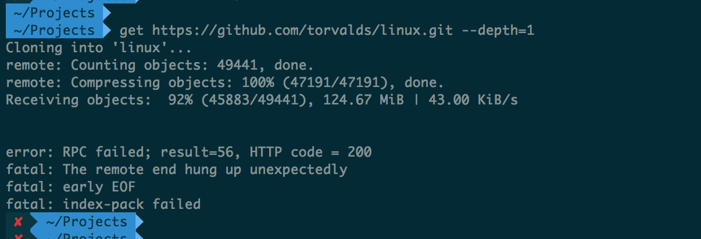
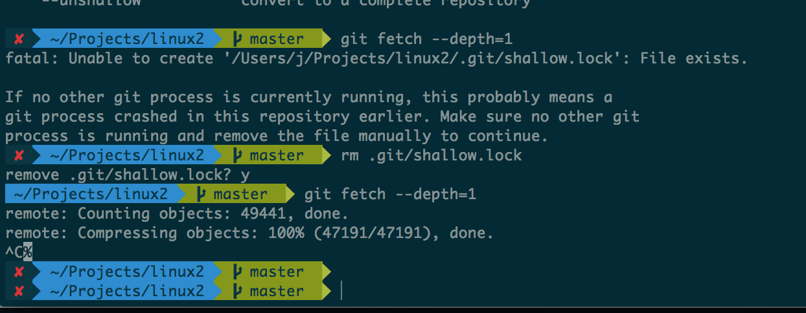

# A word about cloning large git repositories.

I love git!

I got used to its stupid UI over the time and now I'm pretty comfortable with
it. But as always, when you hit a rough edge, it hurts a lot!

I tried cloning the linux kernel today and failed multiple times. I'm really
surprised that clone doesn't handle the most common edge cases and do better.

I tried to clone into a small VM first and it failed silently twice. I was
fortunately watching 'dmesg' and realized that clone failed to allocate some
memory and crashed. Fine! But what about the data that was downloaded already?
git decided to just throw it away. Really?

Well, I have a macbook with 8GB ram! It cannot fail there! Well, here in India
internet connectivity is not that awesome. Minor power outage for a few minutes
and it failed again.

Then I get this idea. Make an empty directory and init a git repository there.
Fetch from the remote repository. I was hoping that this will be fine because
even it fails in the middle, it can resume. Sadly git just decided to ignore the
cache for some reason. Failed again.

The golden hammer turned out to be 'clone --depth=1'. Git can do something
called a 'shallow clone', which is to get only the latest version of the
repository. This will be much smaller for a large project compared to the entire
history and hence should clone just fine. After this, you can deepen the history
progressively with 'git fetch --depth=N' and eventually 'git fetch --unshallow'
to get the complete history.

Why don't do this out of the box folks?

Call me unlucky, that failed too. Another power failure.

I was taking a backup of the folder while it's being cloned, so even when git
decided to delete the damn folder again, I thought I could just 'fetch
--depth=1' inside the copied backup folder. Nope! Failed again because git
ignored the local cache.

Now what do I do? Who can provide me with a git bundle somewhere which I can
download with my beloved 'wget -c'?
