class: middle, center
# An Incremental approach to compiler construction

### blog.jabid.in/talks/inc

### Jaseem Abid
### @jaseemabid

---
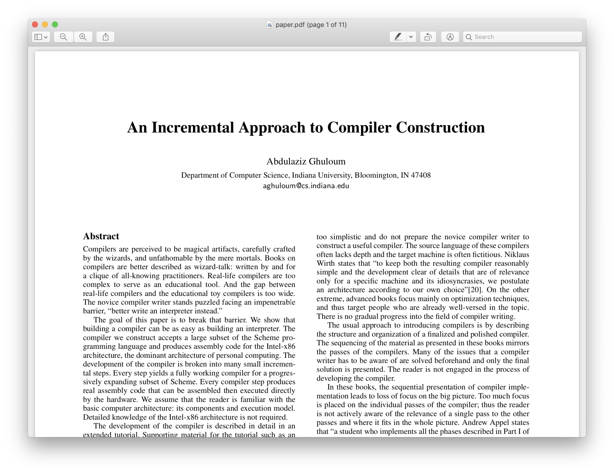

---
class: middle, center

## How to build toy compilers for fun and profit

---

???

- This paper is all about implementation details.

---
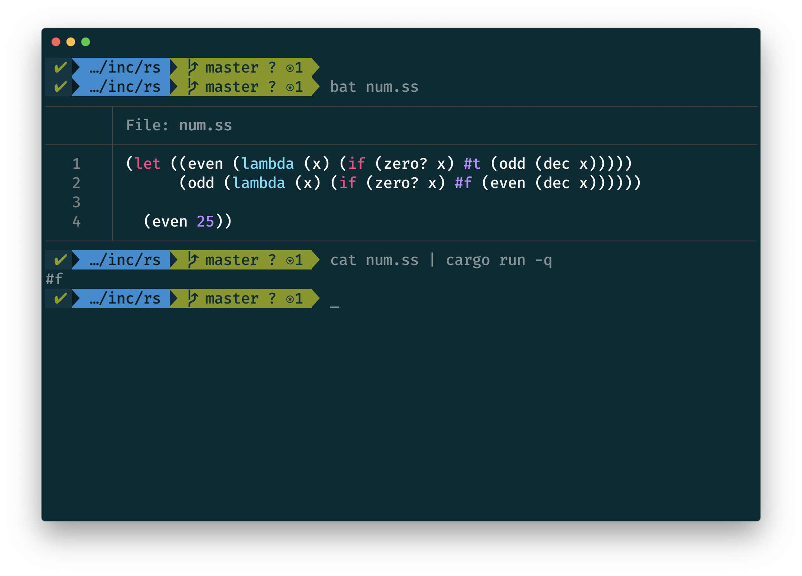

???

- Elevator pitch
- This works

---
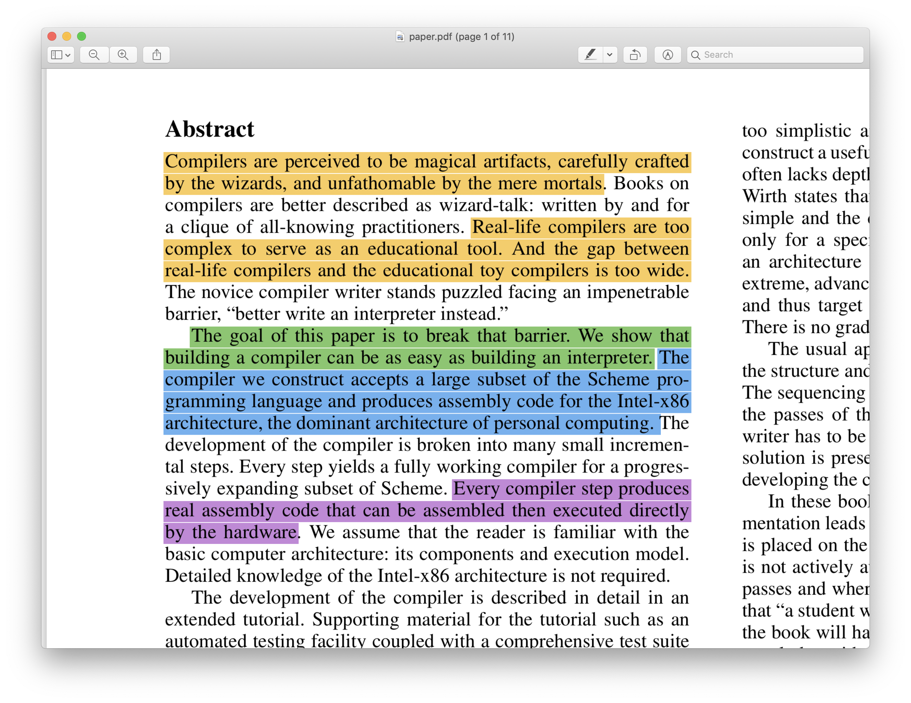

???

- Educational approach, taking the wizards out of the compilers

---
class: center, middle, emoji

# 🚀

---

???

A bit more details into how this works in 3 steps before jumping into steps.

---

---

---
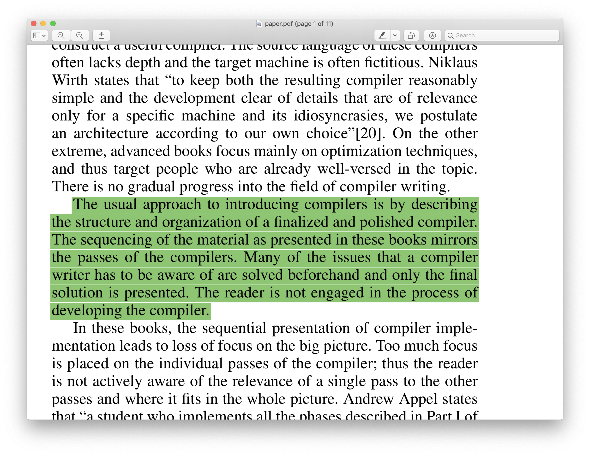

???

- Why is this approach exciting?

---

---

---

---

---
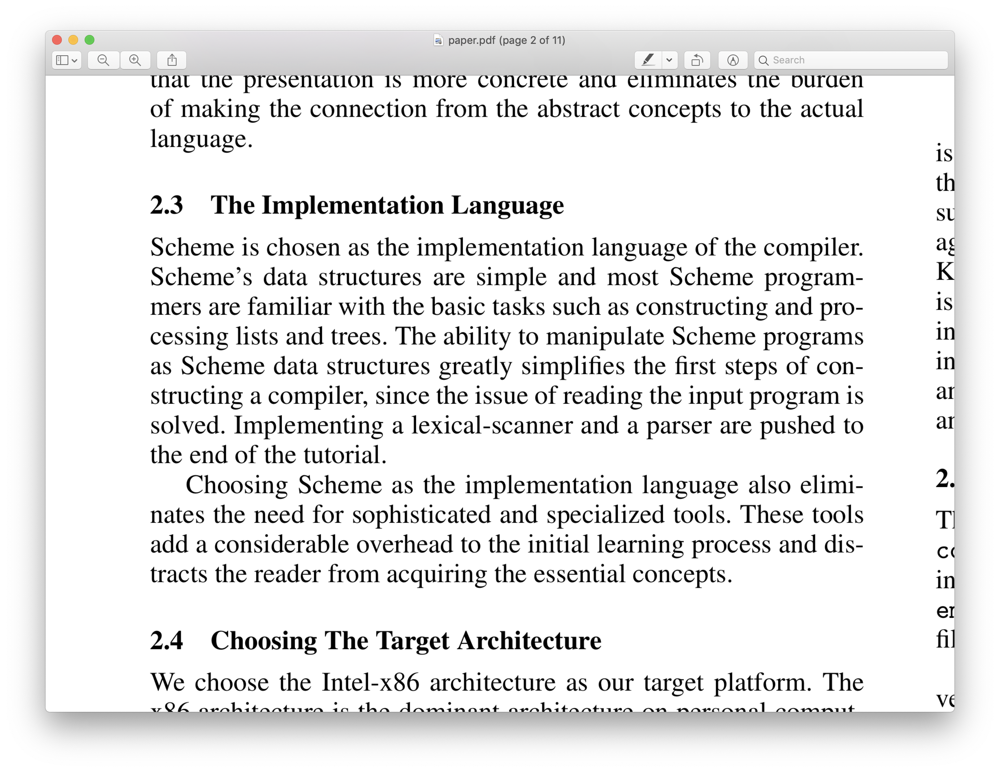

???

- Scheme saves you the trouble of writing a parser
- And parsers are the least fun

---
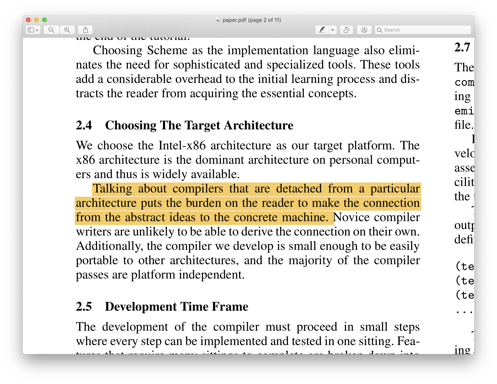

???

- Assembly isn't that hard and this is a good way to learn about it

---
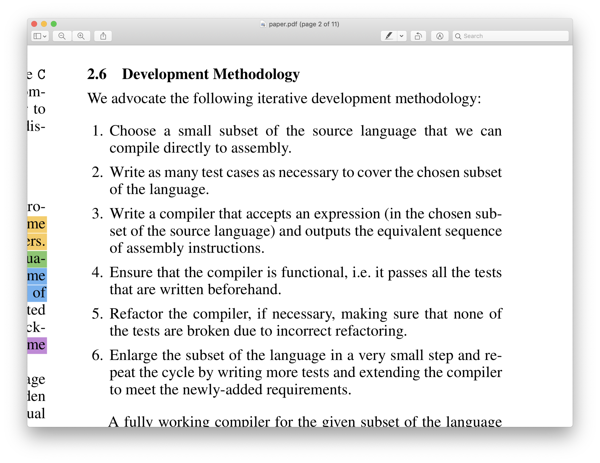

---

---
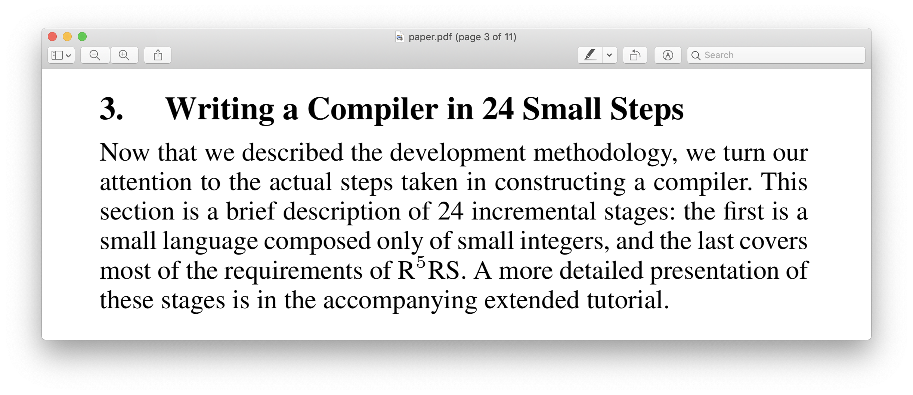

---
class: center, middle, emoji

# ⌛

???

- There really isn't enough time to cover 24, I'd be happy with 5
- The first step is always the hardest ;)

---

???

- Spend as much time as required here in this step to make things clear

---
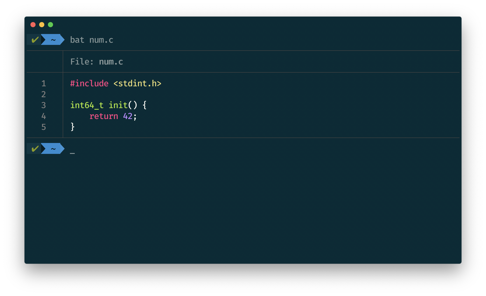

---

???

- https://sourceware.org/binutils/docs/as/P2align.html#P2align

---

???

- Is this a compiler yet?

---

---
class: center, middle, emoji

# 😌✋

---
class: center, middle, emoji

# 💥

---
class: middle

# Recap; why did we do all that?

- Its far easier to generate ASM rather than a binary
- Avoid object files & ELF for now
- A tiny runtime in C is really handy
- Conveniently hiding some OS details
- Link to libc for stdlib
- argc and argv
- IO
- linkers
- ...

---
class: center, middle

# Step 1: Integers
# ✅

???

# TODO: Note the time at this point

---
class: center, middle

# 24 more

---
class: middle

# 2. Immediate Constants

- Types that fit into a machine word
- `int`,  `bool`,  `char`,  `()`
- Types must be available at runtime for `integer?`, `printf` etc
- Tags with bit masking

---
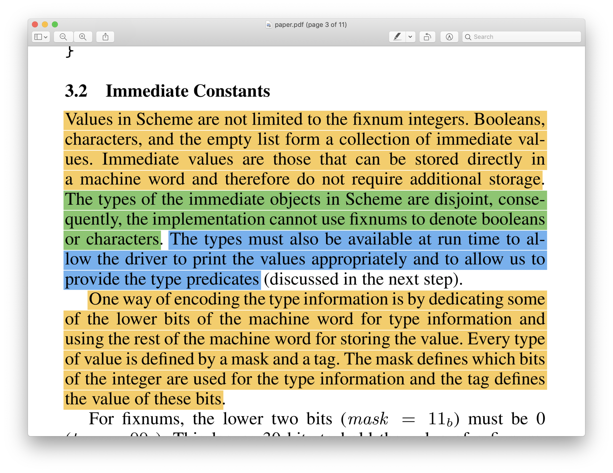

---

???

Note the differences from the paper

---

---

???

- Primitives that accept one word
- No need for a function call
- Inline asm
- inc, dec, int->char, zero?, null?
- Talk about insights

---

???

Binary primitives, no surprises here

---
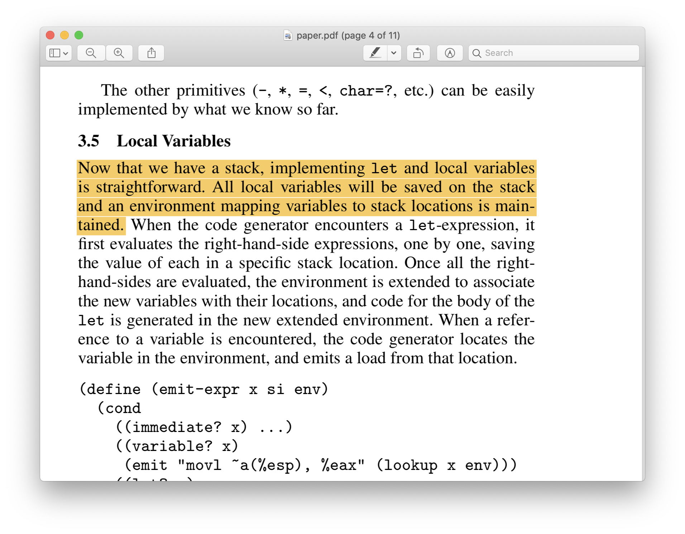

???

Local variables in stack

---

---

---

???

Least fun parts, gotta know some asm jumping

---

---

---
class: center, middle

# ???

---
class: center, middle

# That's all folks (for now)!
