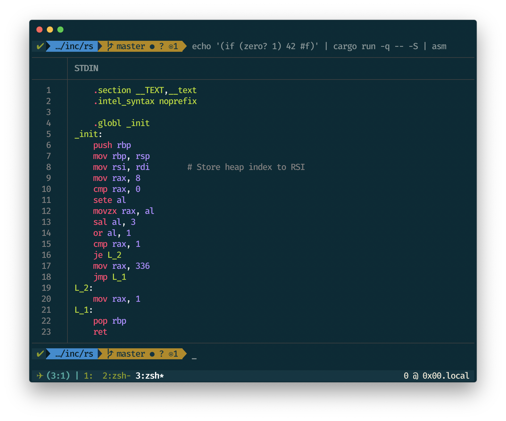
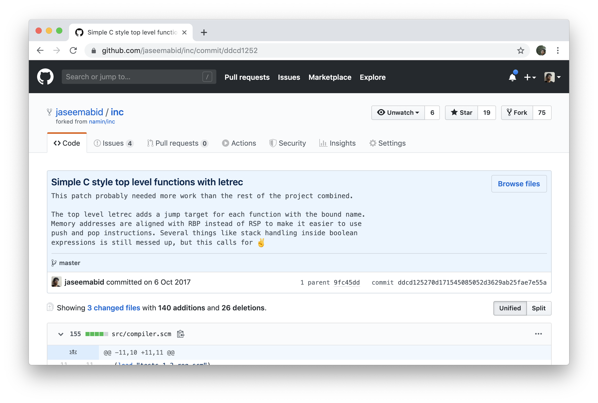

class: middle, center
# An Incremental approach to compiler construction

### blog.jabid.in/talks/inc/rust

### Jaseem Abid
### @jaseemabid

---

---
class: middle, center

## How to build toy compilers for fun and profit

---
class: middle, center

## Rediscovering the joy of programming

---

---

---

???

- Elevator pitch
- This works

---

???

- Educational approach, taking the wizards out of the compilers

---
class: center, middle, emoji

# 🚀

---

???

A bit more details into how this works in 3 steps before jumping into steps.

---

---

---

???

- Why is this approach exciting?

---

---

---

---

---

???

- Scheme saves you the trouble of writing a parser
- And parsers are the least fun

---

???

- Assembly isn't that hard and this is a good way to learn about it

---

---

---

---
class: center, middle, emoji

# ⌛

???

- There really isn't enough time to cover 24, I'd be happy with 5
- The first step is always the hardest ;)

---

???

- Spend as much time as required here in this step to make things clear

---

---

???

- https://sourceware.org/binutils/docs/as/P2align.html#P2align

---
class: center, middle

https://nullprogram.com/blog/2015/05/15

???

The 8086 was introduced in 1978 as a fully 16-bit extension of Intel's 8-bit
8080 microprocessor

Ref: http://flint.cs.yale.edu/cs421/papers/x86-asm/asm.html

---

???

- Is this a compiler yet?

---

---
class: center, middle, emoji

# 😌✋

---
class: center, middle, emoji

# 💥

---
class: middle

# Recap; why did we do all that?

- Its far easier to generate ASM rather than a binary
- Avoid object files & ELF for now
- A tiny runtime in C is really handy
- Conveniently hiding some OS details
- Link to libc for stdlib
- argc and argv
- IO
- linkers
- ...

---
class: center, middle

# Step 1: Integers
# ✅

???

# TODO: Note the time at this point

---
class: center, middle

# 24 more

---
class: middle

# 2. Immediate Constants

- Types that fit into a machine word
- `int`,  `bool`,  `char`,  `()`
- Types must be available at runtime for `integer?`, `printf` etc
- Tags with bit masking

---

---

???

Note the differences from the paper

---

---

???

- Primitives that accept one word
- No need for a function call
- Inline asm
- inc, dec, int->char, zero?, null?
- Talk about insights

---

???

Binary primitives, no surprises here

---

???

Local variables in stack

---

---
class: middle, center

https://eli.thegreenplace.net/2011/02/04/where-the-top-of-the-stack-is-on-x86

---

---

???

Least fun parts, gotta know some asm jumping

---

---

---

---

---

---

---

???

Size is off!

---

---
class: middle

## Interlude

- Clean 64 bit everywhere
- Simpler 3 bit tagging scheme for everything
- Wait! `car` isn't even a function?
- Strings and vectors!

---
class: middle, center, huge

# λ

---

---

---
class: center, middle

# Exercise for the reader?

---
class: middle

## Final thoughts.
### Why would you do this to yourself Jaseem?

--
1. Immensely challenging & intellectually rewarding

--
1. Understanding the true cost of high level constructs

--
1. Understanding what compilers can and cannot do!

--
1. Understanding memory management & language runtimes

--
1. Rust is pure fun!

--
1. Systems programming is fun!

--
1. Chase rabbit holes! 🐰🕳

--
1. Makes me ❤ programming again

???

I babysit servers at work and there is only so much you can do it before you
irreversibly burn out. This keeps me intellectually challenged.

---
class: center, middle

# That's all folks (for now)!
